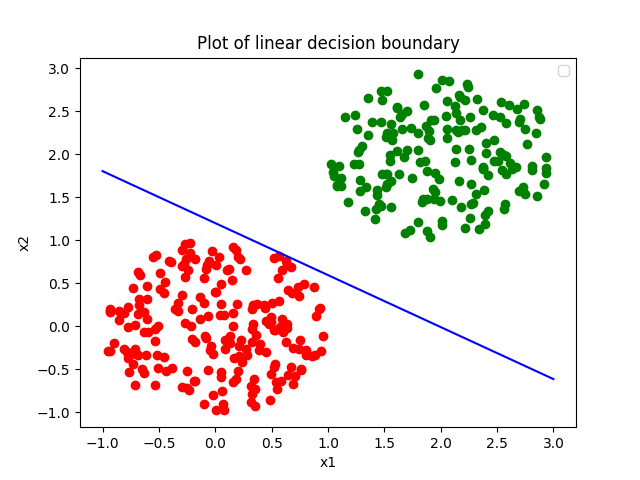

# Machine Learning from Scratch - Python 3
[](https://github.com/HamzaBamohammed/ML-from-scratch-with-Python/blob/main/LICENSE)

[](https://www.python.org/downloads/release/python-360/)

## Overview 
In this package, we've implemented a few basic machine learning algorithms from scratch. The algorithms are implemented in Python 3.8. The algorithms are as follows:
    
- Single Layer Perceptron Algorithm 
- Pocket Perceptron
- Adaline Algorithm with delta rule 
- Linear Regression 
- Logistic Regression 
- Polynomial Regression
- One-vs-All and One-vs-One Classifiers

Furthermore, we've implemented a few basic algorithms useful in the cristalization of learning theory :

- Non-Linear Transformation
- Cross Validation with K-Fold 
- Gradient Descent for Linear and Logistic Regression 
- Regularization for Linear and Logistic Regression
- Bias and Variance <i>(not implemented yet)</i>
- Vapnik Chervonenkis Dimension (VC-Dimension) 
- Covering and Uniform Covering Number

Finally, we also added a few basic functions to help you create dummy data and plot results of the algorithms :

- Generate Dummy Data (in 2D and 3D)
- Plot Linear Decision Boundary (in 2D and 2D)
- Plot Non-Linear Decision Boundary (in 2D)
- Plot Linear Regression (in 2D)

All the algorithms and tools are implemented in the `lib` folder.

These codes were made in the context of the Learning Theory course Fall 2023 at ENSIAS - University Mohammed V - Rabat, Morocco. You can find the LABS and the corresponding PDFs in the `ensias_labs` folder. Do not use them since they are a beta version with a lot of bugs and errors.


## Authors and Contributors

- [@HamzaBamohammed](https://www.github.com/HamzaBamohammed), Applied Mathematics & AI engineering student at ENSIAS
- [@FilaliHicham](https://www.github.com/FILALIHicham), Applied Mathematics & AI engineering student at ENSIAS
- [@BouchraSahri](https://www.github.com/bouchrasa), Applied Mathematics & AI engineering student at ENSIAS
- [@NechbaMohammed](https://www.github.com/NechbaMohammed), Applied Mathematics & AI engineering student at ENSIAS
- Hanaa El Afia, Applied Mathematics & AI engineering student at ENSIAS
- Mohamed Mouhajir, Applied Mathematics & AI engineering student at ENSIAS

## Installation

To install the package, you can use the following command :

```bash
  git clone https://github.com/HamzaBamohammed/ML-from-scratch-with-Python.git
```

# Usage/Examples

## Data Generation (in 2D)
    
```python  
from lib.data import generateData

# make the list of circles as dictionnaries with keys 'center' and 'radius' and "class"
circles = [
    {'center': [0, 0], 'radius': 1, 'class': 1},
    {'center': [2, 2], 'radius': 1, 'class': -1},
    ]

# Generate 500 points in 2D
data = generateData(500, circles, filename='data2D.csv')
```
PS: Don't forget to manually add the features in the first line of the resulting CSV file before proceeding in this tutorial!


## Perceptron Algorithm
```python	
import numpy as np
from lib.classification import PLA
from lib.data import loadData

# Load data
data = loadData('data2D.csv', ['x0','x1','x2','y'])
X = data[:, :-1]
y = data[:, -1]

# Initialize the weights vector
w = np.zeros(X.shape[1])

# Initialize the Perceptron Algorithm
w0, t = PLA(X, y, w)

# Print the weights vector and the number of iterations
print(w0, t)
```

### Plotting Decision Boundary (in 2D)
```python
from lib.plots import plotLinearDecisionBoundary2D

# Plot the decision boundary
plotLinearDecisionBoundary2D(X, y, w0)
```

### Results
```Bash
iter= 1  | loss= 0.0
[ 3.       -1.513614 -2.503794] 1
```


## Logistic Regression
```python
from lib.classification import LogisticRegression
from lib.data import loadData
import numpy as np

# Load data
data = loadData('data2Dlogistic.csv', ['x0','x1', 'x2', 'y'])
X = data[:, :-1]
y = data[:, -1]

# Initialize the logistic regression algorithm
w0, loss = LogisticRegression(X, y)

# Print the weights vector and the number of iterations
print(w0, loss)

# Plot the decision boundary
from lib.plots import plotNonLinearDecisionBoundary2D
plotNonLinearDecisionBoundary2D(X, y, w0, 1)
```
### Results
```Bash
100%    ==================================================>[ 4.94597336 -2.8523291  -2.58496018] 0.013994617998407104

```


## Linear Regression
```python
# make linear regression data
from lib.data import makeRegressionData
data = makeRegressionData(100, degree=1)

X = data[:, :-1]
y = data[:, -1]

# initialize linear regression
from lib.regression import LinearRegression
w0, loss = LinearRegression(X, y)

# print the weights vector and the loss
print(w0, loss)

# plot the decision boundary
from lib.plots import plotRegressionLine2D
plotRegressionLine2D(X, y, w0)
```
### Results
```Bash
[-0.0305375   2.02728691] 0.030354517088163824
```


## Polynomial Regression
```python
# make polynomial regression data
from lib.data import makeRegressionData
data = makeRegressionData(100, degree=3)

X = data[:, :-1]
y = data[:, -1]

# transform the data to a higher dimension
from lib.transformation import polyMap
X3 = polyMap(X, 3)

# initialize polynomial regression
from lib.regression import LinearRegression
w0, loss = LinearRegression(X3, y)

# print the weights vector and the loss
print(w0, loss)
```

### Results
```Bash
[-0.00370442 -0.02731372 -0.00370442 -0.02731372 -0.02731372 -0.01275648
 -0.00370442 -0.02731372 -0.01275648  2.12742621] 0.029404600523786663
```
